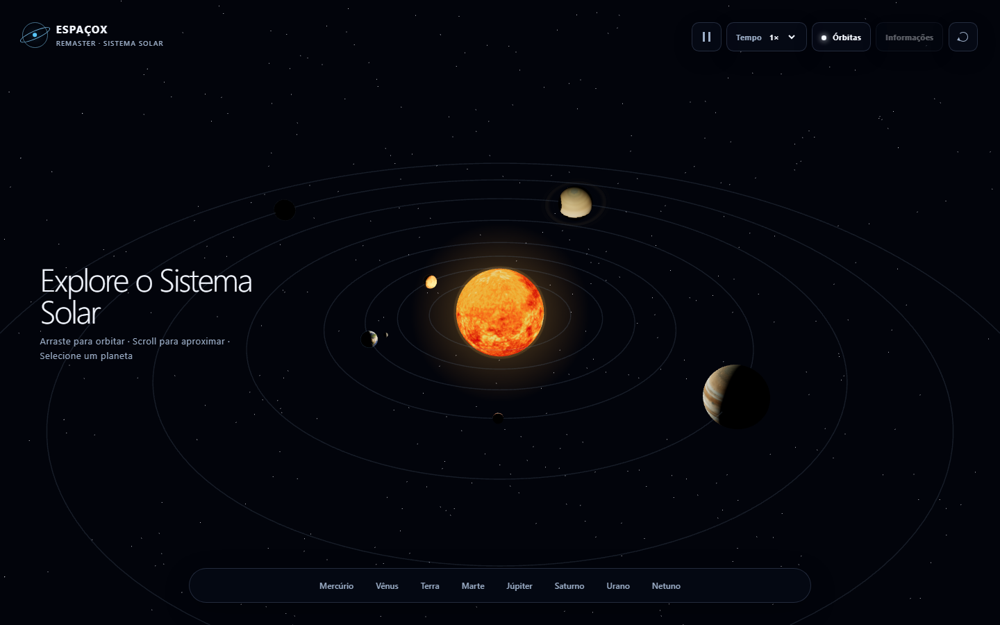
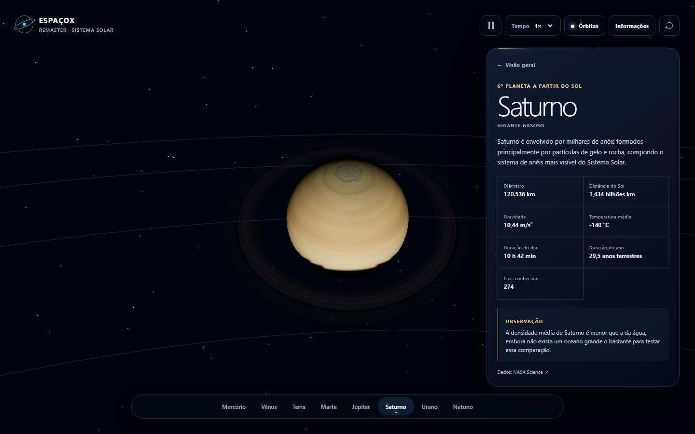

<div align="center">
  <h1>EspaçoX Remaster</h1>
  <p><strong>Uma exploração tridimensional e interativa do Sistema Solar.</strong></p>
  <p>Viaje entre os planetas, controle o tempo e descubra cada mundo em uma experiência criada com Three.js e TypeScript.</p>
</div>

<p align="center">
  
</p>

<p align="center"><sub>Visão orbital — arraste para explorar, use o scroll para aproximar e selecione qualquer planeta.</sub></p>

<p align="center">
  
</p>

<p align="center"><sub>Exploração individual — aproximação cinematográfica, observação livre e dados reunidos em uma interface discreta.</sub></p>

Este projeto começou em 2022 como uma demonstração acadêmica de HTML, CSS, JavaScript, AJAX e PHP. A versão atual retoma a mesma ideia anos depois e a reconstrói como uma experiência espacial moderna com TypeScript, Three.js e Vite — totalmente estática e pronta para hospedagem no GitHub Pages.

## O que mudou

| Versão original | EspaçoX Remaster |
| --- | --- |
| Quatro planetas em cartões | Sol e oito planetas em uma cena 3D explorável |
| Informações carregadas por AJAX/PHP | Dados tipados e centralizados em TypeScript |
| Ilustrações planas | Texturas planetárias, iluminação, atmosfera, nuvens, Lua e anéis |
| Navegação entre telas | Viagem cinematográfica da câmera até cada planeta |
| Dependência de servidor PHP | Build estático compatível com qualquer hospedagem |
| Layout predominantemente desktop | Interface responsiva para mouse, trackpad, teclado e touch |

A intenção educacional e a progressão “boas-vindas → escolha → descoberta” foram preservadas. A arquitetura antiga e os textos desatualizados foram substituídos conscientemente; o histórico Git continua registrando a implementação original.

## Funcionalidades

- Sistema Solar 3D com Sol, Mercúrio, Vênus, Terra, Marte, Júpiter, Saturno, Urano e Netuno.
- Rotação axial e órbitas independentes atualizadas por `deltaTime`.
- Seleção por raycasting ou pela navegação HTML acessível.
- Transições suaves entre visão geral e observação do planeta.
- `OrbitControls` com mouse, trackpad, scroll, pinch e limites de movimento.
- Terra com atmosfera, nuvens e Lua; Saturno com anéis tridimensionais.
- Sol emissivo com halo, corona e iluminação central.
- Campo de estrelas procedural em camadas.
- Velocidades `0.5×`, `1×`, `2×`, `5×`, `10×` e pausa.
- Órbitas, informações e câmera controláveis pela interface.
- Loading com progresso real dos assets.
- Perfis gráficos adaptativos, DPR limitado e texturas reduzidas para dispositivos modestos.
- Suporte a `prefers-reduced-motion`, teclado, foco visível e alternativa sem WebGL.

## Stack

- HTML5 semântico
- CSS moderno
- TypeScript em modo estrito
- Three.js
- Vite
- Vitest
- npm

Não são utilizados PHP, jQuery, React, Vue, Angular, Tailwind ou backend.

## Como executar

Requisitos: Node.js 20 ou superior e npm.

```bash
npm install
npm run dev
```

O Vite exibirá o endereço local no terminal, normalmente `http://localhost:5173`.

### Verificações

```bash
npm run check
npm test
npm run build
npm run preview
```

- `check`: valida TypeScript sem emitir JavaScript.
- `test`: executa testes de integridade dos dados e da simulação.
- `build`: valida TypeScript e gera o site estático em `dist/`.
- `preview`: serve localmente o build de produção.

## Controles

| Ação | Desktop | Touch |
| --- | --- | --- |
| Orbitar câmera | Arrastar | Arrastar |
| Aproximar ou afastar | Scroll/trackpad | Pinch |
| Selecionar planeta | Clique ou barra inferior | Toque ou barra inferior |
| Voltar à visão geral | Botão, marca ou `Esc` | Botão ou marca |
| Pausar e mudar velocidade | Controles superiores | Controles superiores |

Ao selecionar Terra → Júpiter → Marte → Urano, na ordem, uma pequena memória da versão original é revelada.

## Arquitetura

```text
src/
├── cena/          # renderer, objetos 3D, luzes, estrelas e texturas
├── controles/     # câmera, OrbitControls e raycasting
├── dados/         # fonte única dos dados planetários
├── estilos/       # base visual, interface e responsividade
├── interface/     # estado e eventos dos elementos HTML
├── utilitarios/   # matemática e tempo da simulação
├── configuracao.ts
├── tipos.ts
└── main.ts
```

`SistemaSolar` coordena o ciclo de renderização e os corpos celestes. Câmera, seleção e interface ficam em módulos independentes ligados por callbacks tipados. Os dados científicos e visuais vivem em uma única coleção, evitando números mágicos espalhados pela aplicação.

## Escala visual

O Sistema Solar real não cabe de maneira legível em uma tela: se as distâncias fossem proporcionais, os planetas seriam quase invisíveis. Por isso, esta aplicação utiliza duas escalas comprimidas:

- Os raios preservam a hierarquia visual — Júpiter e Saturno continuam muito maiores que a Terra, e Mercúrio continua sendo o menor planeta — sem adotar a proporção astronômica absoluta.
- As distâncias orbitais crescem de forma consistente, mas são compactadas para permitir que os oito planetas participem da mesma composição.
- As velocidades também são normalizadas. Planetas internos continuam mais rápidos que os externos, mas Netuno não precisa de 165 anos para completar uma órbita na tela.

Essa escolha privilegia compreensão e exploração, não uma simulação física de precisão.

## Performance e responsividade

- Uma geometria esférica é reutilizada por todos os corpos.
- Texturas são carregadas uma única vez e mantidas em cache.
- Dispositivos econômicos recebem mapas de 1K, menos estrelas, menos segmentos e DPR máximo de `1.25`.
- O perfil alto usa texturas de 2K, sombras moderadas e DPR máximo de `1.5`.
- Nenhum objeto temporário é criado pelo loop principal para movimentar os planetas.
- O painel lateral se transforma em bottom sheet em telas estreitas.
- Usuários com redução de movimento iniciam com a simulação pausada e sem introdução prolongada.

## Conteúdo e assets

Os dados foram reescritos a partir das páginas de fatos da [NASA Science](https://science.nasa.gov/solar-system/). As quantidades de luas são descobertas científicas sujeitas a atualização; os valores registrados refletem as fontes consultadas em setembro de 2026.

As texturas planetárias são do [Solar System Scope](https://www.solarsystemscope.com/textures/), baseadas em dados e imagens da NASA e distribuídas sob [Creative Commons Attribution 4.0](https://creativecommons.org/licenses/by/4.0/). Os arquivos foram incorporados ao projeto e redimensionados localmente para variantes de 1K; não há hotlink em produção. Consulte [CREDITOS.md](./CREDITOS.md) para a relação completa.

## Publicação manual no GitHub Pages

O Vite usa `base: './'`, portanto o build funciona dentro do subdiretório do repositório.

1. Gere a versão de produção:

   ```bash
   npm run build
   ```

2. Publique `dist/` em uma branch `gh-pages`. Uma opção sem alterar as dependências do projeto é:

   ```bash
   npx gh-pages -d dist
   ```

3. No GitHub, abra **Settings → Pages**, selecione **Deploy from a branch** e escolha `gh-pages` na raiz.

Não há workflow automático de GitHub Actions nesta versão.
